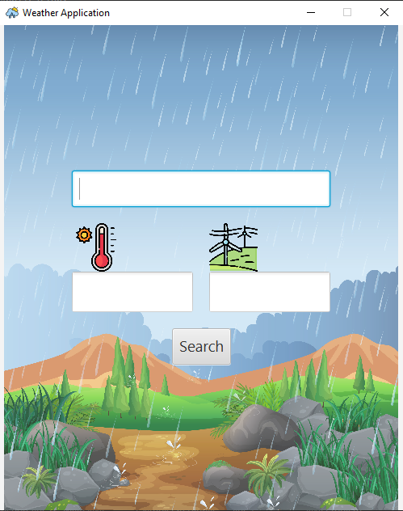

# A Simple Weather Data Fetching Application Coded in Java.
## Displays wind speed and temperature of the city given in the search bar. 
    - Coded using Java libray JavaFx and OpenWeatherAPI

## UI Display of the Weather Application
